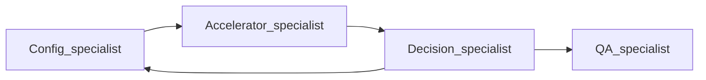

# AGENTS.md — deployment agent and GO/NO-GO stability

This document is for contributors and coding agents working on **deployment verdicts**, supervisor behavior, or the decision specialist. It complements [README.md](README.md) (install, CLI, Streamlit).

**Canonical quantization × hardware reference (verify periodically):** [vLLM — Quantization — Supported Hardware](https://docs.vllm.ai/en/latest/features/quantization/#supported-hardware)  
Last aligned with that page: **April 2026** (vLLM “latest” docs). The chart changes as vLLM evolves—when in doubt, use the URL, not this file alone.

---

## Scope

- Supervisor orchestration and specialist prompts under `src/runtimes_dep_agent/agent/`.
- Decision outputs: `info/deployment_info.txt`, `info/deployment_matrix.json`, and how UIs/reports parse **GO** vs **NO-GO**.
- Quantization and accelerator compatibility rules used by the **Decision Specialist** (must stay aligned with [decision_specialist.py](src/runtimes_dep_agent/agent/specialists/decision_specialist.py) and the vLLM doc above).

---

## End-to-end flow

The top-level supervisor coordinates specialists. Order and safety rules are defined in [`llm_agent.py`](src/runtimes_dep_agent/agent/llm_agent.py) (`_create_supervisor` system prompt).

Typical full assessment:

1. **Configuration Specialist** — model-car requirements, VRAM estimates, YAML details.
2. **Accelerator Specialist** — cluster GPUs, `gpu_info.txt`, runtime image hints.
3. **Decision Specialist** — GO/NO-GO style deployability, serving-args fit, quantization vs hardware (see below).
4. Optionally **Configuration Specialist** again — apply `OPTIMIZED_SERVING_ARGUMENTS_JSON` before QA.
5. **QA Specialist** — only when the environment is healthy and policy allows (supervisor must **not** call QA if the cluster is unreachable or auth failed).

**Critical supervisor rule:** If the accelerator step reports authentication or connectivity failure, the final verdict must be **NO-GO** and QA must not run. See the supervisor prompt in `llm_agent.py`.

---

## Artifacts (inputs / outputs)

| Artifact | Role |
| -------- | ---- |
| Bootstrap model-car YAML (e.g. `config-yaml/…`) | Input; drives precomputed requirements. |
| `info/models_info.json` | Precomputed per-model requirements (written when bootstrap is loaded). |
| `info/gpu_info.txt` | Accelerator Specialist / cluster GPU snapshot; feeds deterministic VRAM fit. |
| `info/deployment_info.txt` | Decision Specialist narrative output (verdict text for UI/report). |
| `info/deployment_matrix.json` | Structured deployable / not deployable per model (from `deployability_decision` tool). |

Comparable runs should use the **same** bootstrap YAML, **same** cluster/GPU snapshot (or understand that changing `gpu_info.txt` changes capacity), and the **same** Gemini model name when debugging flaky verdicts.

---

## Stable verdict rubric (recommended order)

Apply reasoning in this order so GO/NO-GO stays consistent:

1. **Environment health** — Cluster reachable? Credentials valid? If **no** → **NO-GO** (do not rely on VRAM math alone).
2. **Capacity** — Per-GPU memory and GPU count vs model VRAM and tensor-parallel needs. The tool `assess_deployment_fit` in [`decision_specialist.py`](src/runtimes_dep_agent/agent/specialists/decision_specialist.py) produces a deterministic string from `gpu_info.txt` + precomputed requirements.
3. **Quantization vs hardware** — Map detected accelerators to the **vLLM Supported Hardware** table (NVIDIA architecture columns vs **AMD GPU** for ROCm). See the next section.
4. **Serving arguments** — `tensor_parallel_size`, `max_model_len`, executor backend, flags consistent with hardware and memory.

### Verdict text contract

Downstream parsers look for explicit markers on the **first line** after the marker:

- Use **`### Deployment Decision`** or lines containing **`Verdict:`** / **`Deployment Decision:`** with **`GO`** or **`NO-GO`** (or `NO GO`).

Parsing logic:

- [`html_report._extract_verdict`](src/runtimes_dep_agent/report/html_report.py) — scans for `verdict:` and `deployment decision:`.
- [app.py](app.py) (Streamlit) — matches strings such as `DEPLOYMENT DECISION: NO-GO`, `VERDICT: GO`, etc.

If the narrative is ambiguous, automated verdict badges may show **UNKNOWN** or mis-label the run.

---

## Quantization vs NVIDIA and AMD (ROCm) hardware

**Source of truth:** [vLLM — Supported Hardware](https://docs.vllm.ai/en/latest/features/quantization/#supported-hardware).

The upstream doc uses **NVIDIA** microarchitectures (Volta … Hopper) and a separate **AMD GPU** column (typically ROCm). Intel Gaudi is called out there as moved to vLLM-Gaudi; Google TPU has a separate note.

### Reproduced summary (April 2026, “latest” doc)

| Implementation | Volta | Turing | Ampere | Ada | Hopper | AMD GPU | Intel GPU | x86 CPU |
| -------------- | ----- | ------ | ------ | --- | ------ | ------- | --------- | ------- |
| AWQ | — | ✓ | ✓ | ✓ | ✓ | — | ✓ | ✓ |
| GPTQ | ✓ | ✓ | ✓ | ✓ | ✓ | — | ✓ | ✓ |
| Marlin (GPTQ/AWQ/FP8/FP4) | — | ✓* | ✓ | ✓ | ✓ | — | — | — |
| INT8 (W8A8) | — | ✓ | ✓ | ✓ | ✓ | — | — | ✓ |
| FP8 (W8A8) | — | — | — | ✓ | ✓ | ✓ | — | — |
| bitsandbytes | ✓ | ✓ | ✓ | ✓ | ✓ | — | — | — |
| DeepSpeedFP | ✓ | ✓ | ✓ | ✓ | ✓ | — | — | — |
| GGUF | ✓ | ✓ | ✓ | ✓ | ✓ | ✓ | — | — |

Doc footnotes (abbreviated): Volta = SM 7.0; Turing = 7.5; Ampere = 8.0/8.6; Ada = 8.9; Hopper = 9.0. ✓ = supported; — = not supported. **\*** Turing: Marlin **MXFP4** not supported.

For **AMD** accelerators, use the **AMD GPU** column only (not NVIDIA generation columns). Example: **FP8** and **GGUF** show support on AMD GPU in this table; **AWQ** / **GPTQ** / **bitsandbytes** do not in this snapshot.

### Mapping cluster GPU names to this table

Use accelerator strings from the cluster report or `gpu_info.txt`:

- **NVIDIA:** A100, A30, A10 → often **Ampere**; H100 → **Hopper**; L4, L40, many RTX 40xx → **Ada**; V100 → **Volta**; T4 → **Turing**.
- **AMD:** Treat as **AMD GPU** column for quantization compatibility (ROCm).

If the quantization method is **not** in the table, check the full [Quantization](https://docs.vllm.ai/en/latest/features/quantization/) index and the linked **Supported Hardware** section before declaring incompatibility.

### Drift policy

- The **Decision Specialist** system prompt in [`decision_specialist.py`](src/runtimes_dep_agent/agent/specialists/decision_specialist.py) must match this vLLM table. If upstream vLLM changes the table, update **both** that prompt and this **AGENTS.md** section (or introduce a single shared data source in code later).
- Do not maintain a second, conflicting matrix in ad-hoc prompts.

---

## Deterministic vs LLM-driven behavior

| Component | Behavior |
| --------- | -------- |
| Supervisor (`LLMAgent`) | LLM with `temperature=0`; still free-form synthesis—use the rubric above for consistency. |
| `assess_deployment_fit` | Deterministic: parses `gpu_info.txt` and precomputed requirements. |
| `deployability_decision` | Writes JSON to `deployment_matrix.json` from model-produced JSON. |
| Final narrative in `deployment_info.txt` | LLM output—must follow verdict markers for tooling. |

---

## Stability / reproducibility checklist

- [ ] Same bootstrap model-car YAML and same precomputed `models_info.json` semantics.
- [ ] Same `gpu_info.txt` (or accept that cluster state changed).
- [ ] Same Gemini model id (e.g. `gemini-2.5-pro`) and `GEMINI_API_KEY` for comparable LLM steps.
- [ ] After vLLM doc updates: refresh **AGENTS.md** and **`decision_specialist.py`** matrix together.
- [ ] Prefer explicit **Deployment Decision** / **Verdict** lines so Streamlit and HTML reports agree.

---

